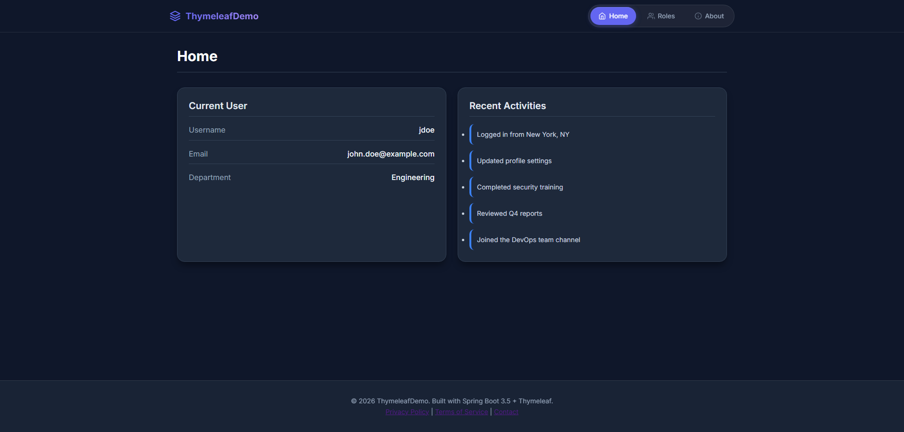
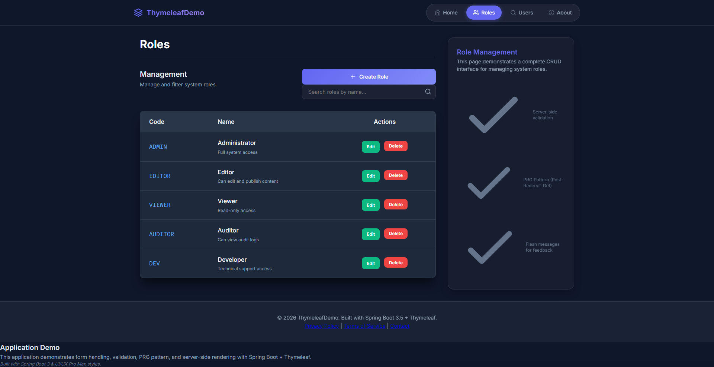
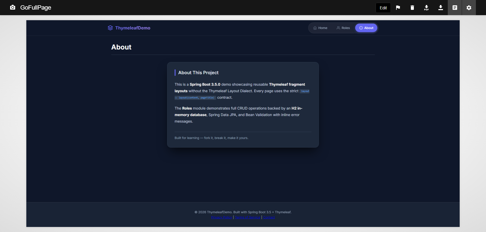

# Spring Boot 3.5.0 + Thymeleaf CRUD Demo

A modern, high-performance CRUD implementation showcasing **Thymeleaf Fragments** for layout management, **Spring Data JPA**, and a **Glassmorphic UI**.

## 📸 Screenshots

### Home Dashboard (**Static**)
*Demonstrates a dashboard rendering static model data within the shared layout.*


### Roles Management (**Dynamic CRUD**)
*A fully functional CRUD interface backed by an H2 database, featuring validation and JPA persistence.*


### About Page (**Static**)
*A simple informational page showcasing how static content fits into the fragment-based layout.*


## 🚀 Key Features
- **Strict Theme-less Layouts**: Uses a pure fragment-based system (`layout :: layout`). No extra dialects or XML decorators required.
- **Glassmorphic Design**: A premium dark-mode interface featuring pill-tab navigation, backdrop blurs, and neon accents.
- **H2 Persistence**: Fully functional CRUD with an in-memory H2 database.
- **Robust Validation**: Server-side Bean Validation with real-time error feedback in the UI.
- **Responsive**: Mobile-first design that adapts gracefully to all screen sizes.

## 🛠 Tech Stack
- **Core**: Spring Boot 3.5.0
- **View**: Thymeleaf (Fragment Layouts)
- **Database**: H2 (In-Memory)
- **ORM**: Spring Data JPA / Hibernate
- **Styling**: Vanilla CSS (Modern CSS Variables + Flex/Grid)
- **Typography**: Inter (UI) & Fira Code (Data/Monospace)

## 📱 Navigation & Pages

| Tab | Route | Description |
|-----|-------|-------------|
| **Home** | `/` | Dashboard view with user profile and activity feed. |
| **Roles** | `/roles` | Complete CRUD interface for role management. |
| **About** | `/about` | Project details and architectural overview. |

## 📂 Project Architecture

### Logic layer
- `RoleController` — Handles CRUD operations and validation.
- `HomeController` — Serves dashboard data.
- `AboutController` — Serves static informational content.
- `DataInitializer` — Seeds the database with default roles on boot.

### Data Layer
- `Role` — JPA Entity with `@NotBlank` and unique constraint validation.
- `RoleRepository` — Extends `JpaRepository` for effortless persistence.

### Interface Layer
- `layout.html` — The master shell. Owns the `<head>`, CSS, and overall structure.
- `header.html` — Glassmorphic navigation bar with SVG icons.
- `role-form.html` — Reusable form for both creating and editing records.

## 🏃 How to Run

1. **System Requirements**: Java 17+ and Maven.
2. **Launch Application**:
   ```bash
   mvn clean spring-boot:run
   ```
3. **Access UI**: [http://localhost:8080](http://localhost:8080)
4. **Database Console**: [http://localhost:8080/h2-console](http://localhost:8080/h2-console)
   - **JDBC URL**: `jdbc:h2:mem:roledb`
   - **User**: `sa` / **Password**: `password`

## 🏗 Creating New Pages

This project includes a **Starter Template** (`template.html`) to help you quickly build new pages that inherit the glassmorphic design system.

1.  **Controller**: Set `pageTitle` and `activeModule` in your `Model`.
2.  **HTML**: Copy `template.html`, keeping the `th:replace` call.
3.  **Content**: Place your custom HTML inside the `th:fragment="content"` block.

## 🏗 The Layout Contract
This project uses a strict, non-intrusive layout contract. Pages "wrap" themselves in the layout fragment rather than the layout "decorating" the page:

```html
<!-- In any content page (e.g., home.html) -->
<div th:replace="~{layout :: layout(~{::content}, ${pageTitle})}">
    <div th:fragment="content">
        <!-- Your specific page HTML goes here -->
    </div>
</div>
```

The master `layout.html` then renders the injected page fragment using:
```html
<div th:replace="${content}"></div>
```
